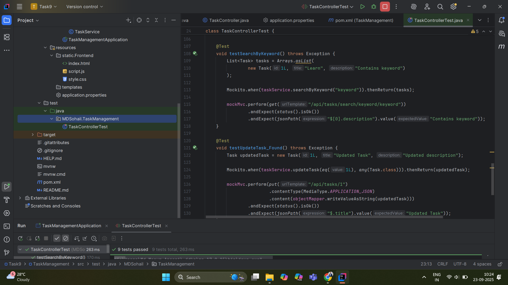

# Task Management Application

## Overview
Task Management Application is a **Spring Boot REST API** that allows users to **create, read, update, delete, and search tasks**.  
It demonstrates **CRUD operations**, **exception handling**, and **unit testing** to ensure API reliability.

---

## Unit Testing
- Tests are located in:  
src/test/java/MDSohail/TaskManagement/TaskControllerTest.java

- Tools used: **JUnit 5**, **Mockito**, **MockMvc**  
- Tests cover:
- Creating a task
- Fetching all tasks
- Fetching a task by ID
- Updating a task
- Deleting a task
- Searching by title or description keyword
- Run tests to verify API functionality.  
- ✅ Green = All tests passed  
- ❌ Red = Test failed (check console for details)

---

## Screenshot

---

## Author
**MD Sohail Ansari**  
